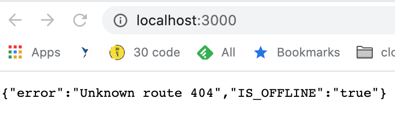

# imageProcessingServerless

## Requirements

- Install Node v12+ (Recommend using a node version manager: http://npm.github.io/installation-setup-docs/installing/using-a-node-version-manager.html)
- Install app run `npm i` from the root directory
- Install Docker: https://docs.docker.com/compose/install/
- Install serverless: https://www.serverless.com/framework/docs/providers/aws/guide/installation/
- To start localstack (AWS Local cloud stack - https://github.com/localstack/localstack) environnement run `docker-compose up -d`
- Use `docker logs imageprocessingserverless_localstack_1`
& wait for localstack to be ready
- Build the app `npm run local`
- Run unit/integration test `npm run test`
- To test end 2 end, we create an s3 bucket via localstack `npm run create-bucket`
- Start the offline server `npm run local-server`
  - Click on the link to check the Offline server is listening on http://localhost:3000 
  - 
- Use Postman to import api request templates `Serverless-ImageProcessor.postman_collection.json`
  - 
- Stop app run `docker-compose down`

## Debugging
Serverless functions can be debugged using serverless offline
- `npx --node-arg='--inspect-brk=0.0.0.0:9099' serverless offline`

# Other Considerations
Batching: via endpoint request that takes an array of base64 encoded images vs serverless approach to concurrent lambdas for each image request. 

CDN/Cloudfront: Could have lambda that immediately triggers after upload to s3. Then converts image to all required types and sizes and stores in CDN. Then when image requested it could be served from an edge location, would be highly preformat but would take up more storage space. Normally storage is cheaper than network but depends on the need/use case.

Another future consideration if the user was uploading an image and wanting to manipulate it immediately and get back the converted image. We could run the conversion as a lambda edge function, return the converted image and then save both. 